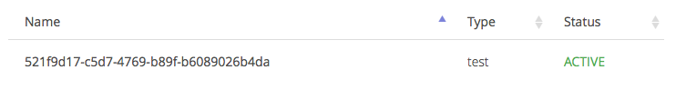

# Connecting your IoT device to the cloud with mbed

First let's set up our device. Tri-color LED on a breadboard. 220 Ohm on red and blue pin, less resistance on the green one, because it's less bright (here 2x 220 Ohm in parallel = 110 Ohm).

So we need device connector library. `yt install mbed-client`. Our main.cpp we can copy from [here](https://github.com/ARMmbed/mbed-client-examples/blob/master/source/main.cpp). It's a bit much code. But a las.

Now sign up for connector, and click 'My Devices' -> 'Security Credentials' -> 'Get my security credentials'.

Get that file and store it as source/security.h... Now in main.cpp add some code to address the tri-color LED:

```cpp
static DigitalOut red(YOTTA_CFG_HARDWARE_PINS_D5);
static DigitalOut blue(YOTTA_CFG_HARDWARE_PINS_D6);
static DigitalOut green(YOTTA_CFG_HARDWARE_PINS_D7);
```

Build the app and flash device. Now connect to the device over screen. Or use Arduino Serial Monitor (9600 baud), it's nice. You should see something like:

```
IP address 192.168.2.8
Device name 521f9d17-c5d7-4769-b89f-b6089026b4da

Registered
```

Now if you go to [Connected devices](https://connector.mbed.com/#endpoints) page, you should see the device as Active...



We can send some data back to the cloud now by pressing SW2 button (in the `update_resource` function). It will say that in the console as well...

```
updating resource to 1
updating resource to 2
```

Now we can go to the [API Console](https://connector.mbed.com/#console) and query the status of the device:

```
https://api.connector.mbed.com/endpoints/521f9d17-c5d7-4769-b89f-b6089026b4da/Test/0/D
```

*Todo: What's the difference between /S and /D??*


*The payload is base64 decoded, and we encoded the value that we send in ASCII on the device.*

## Getting the data outside of the API console

So we can get data from device -> cloud in the API console. But now we need to also do stuff with it. We want to receive notifications when stuff happens.

Need to set up a webserver at public URL, so connector can ping us. I made an example web server (in node.js) [here](putlinkhere).

Let's say I'm listening on http://two-way-mbed-connector-janjongboom1.c9users.io/notification. I now need to register myself as a notification channel with connector. I can do it from curl easily.

```
curl -X PUT -v -H 'Content-Type: application/json' -H 'Authorization: Bearer YOUR_AUTH_TOKEN' -d '{ "url": "http://two-way-mbed-connector-janjongboom1.c9users.io/notification" }' https://api.connector.mbed.com/notification/callback
```

Now connector knows where to send data to, and we'll receive it in our application. All calls in connector are async, so if we want to get the status, we need to make request to connector, get a asyncId, wait for the notification to come in, and then use it.

This basically boils down to (pseudo-code):

```js
ee = EventBus()

// this gets called whenever connector notifies us
onNotification = fn(asyncId, body) {
    ee.emit(asyncId, body)
}

// make request to connector
connectorResponse = request('https://api.connector.mbed.com/endpoints/YOUR_ID/Test/0/D')

// the response comes through notification channel (onNotification function)
ee.on(connectorResponse.asyncId, fn(body) {
    printf("Value is " + body)
})
```

In the sample web application this is in the '/status/:id' route.

## Acting when the user presses a button

Now we want to also listen on events so we can do something without explicly requesting the thing. We can subscribe to events for this device via curl:

```
curl -X PUT -v -H 'Authorization: Bearer YOUR_AUTH_TOKEN' https://api.connector.mbed.com/subscriptions/521f9d17-c5d7-4769-b89f-b6089026b4da/Test/0/D
```

*I have to call this function all the time, why the hell doesn't it just remember it?!!*

Now the notification route will also be called when someone presses a button on the device. We can parse the data and do something with it:

```js
req.body['notifications'].forEach(function(notification) {
  // for now just log it
  console.log('New event for', notification.ep, notification.path,
    new Buffer(notification.payload, 'base64').toString('utf-8'));
});
```

We now get data in every time we press a button. For now it just logs to the console, but we can easily change this to stream it over a web socket or do something other interesting with it.

## Sending data back to the device

In main.cpp we have a handler to receive data: `value_updated`. If we now post some data to the device via:

```
curl -X PUT -d "R" -v -H 'Authorization: Bearer YOUR_AUTH_TOKEN' https://api.connector.mbed.com/endpoints/521f9d17-c5d7-4769-b89f-b6089026b4da/Test/0/D
```

In the logs (and also in your web app if you have notifications on) we'll see:

```
Value updated of Object name D and Type 1
```

Let's do something nice with that! We can get the value of the object through:

```cpp
void value_updated(M2MBase *base, M2MBase::BaseType type) {
    output.printf("\nValue updated of Object name %s and Type %d\n",
           base->name().c_str(), type);

    M2MResource* res = (M2MResource*)base;
    uint8_t* buffer = NULL;
    uint32_t length = 0;
    res->get_value(buffer, length);
    output.printf("Got data len=%d data=%s\n", length, (char*)buffer);

    red = buffer[0] == 'R';
    green = buffer[0] == 'G';
    blue = buffer[0] == 'B';
}
```

Which will now also log the value we put here. We can now switch the color of the LED through curl.

```
curl -X PUT -d "R" -v -H 'Authorization: Bearer YOUR_AUTH_TOKEN' https://api.connector.mbed.com/endpoints/521f9d17-c5d7-4769-b89f-b6089026b4da/Test/0/D
```

## Bringing it all together

In the small node.js example app we bring everything together and have an end-to-end two-way data connection between a browser and a device through mbed connector and websockets.

Todo:

* Now we use one datachannel for the clicks and for the LED. That's not good, should use two. Excercise for the reader.

Put video here.
